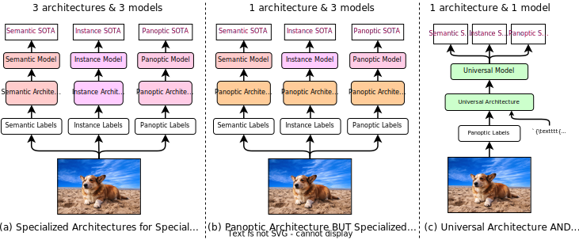

# OneFormer Colab Demo

[](https://pytorch.org/) [](https://opensource.org/licenses/MIT)

<!-- [](https://huggingface.co/spaces/shi-lab/OneFormer) -->

[Jitesh Jain](https://praeclarumjj3.github.io/), [Jiachen Li](https://chrisjuniorli.github.io/)<sup>&dagger;</sup>, [MangTik Chiu](https://www.linkedin.com/in/mtchiu/)<sup>&dagger;</sup>, [Ali Hassani](https://alihassanijr.com/), [Nikita Orlov](https://www.linkedin.com/in/nukich74/), [Humphrey Shi](https://www.humphreyshi.com/home)

<sup>&dagger;</sup> Equal Contribution

[[`Project Page`](https://praeclarumjj3.github.io/oneformer/)] [[`arXiv`](http://arxiv.org/abs/2208.03382)] [[`GitHub`](https://github.com/SHI-Labs/OneFormer)] [[`BibTeX`](#citation)]

This repo contains the code for the colab demo for our paper **OneFormer: One Transformer to Rule Universal Image Segmentation**. For more information about OneFormer, please check out our [Project Page](https://praeclarumjj3.github.io/oneformer/) and [GitHub repo](https://github.com/SHI-Labs/OneFormer).



## Citation

If you found OneFormer useful in your research, please consider starring ⭐ us on GitHub and citing 📚 us in your research!

```bibtex
@article{jain2022oneformer,
      title={OneFormer: One Transformer to Rule Universal Image Segmentation},
      author={Jitesh Jain and Jiachen Li and MangTik Chiu and Ali Hassani and Nikita Orlov and Humphrey Shi},
      journal={arXiv}, 
      year={2022}
    }
```
